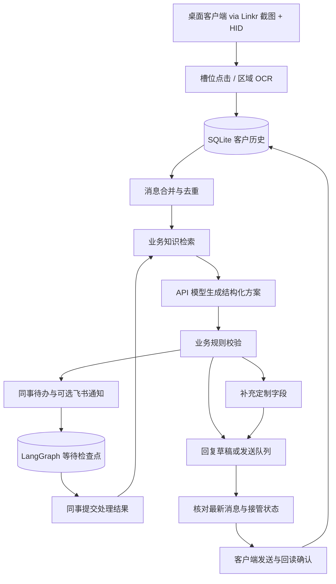

# 本地客服应用架构（cs-duty）

## 运行边界

一台设备运行一个本机 HTTP 服务、一个受控的桌面客户端连接和最多两个模型工作线程。前端采用静态 HTML/CSS/JavaScript，不需要 Node、容器、Redis 或独立 OpenClaw 服务。LangGraph 是受控业务流程编排器；模型没有任意执行代码或操作电脑的权限。客户通道不读取网页 DOM，全部通过 Linkr 截图、Windows OCR 与 USB HID。

只有客户端线程截图、识别与注入输入；不同客户的模型请求可以并行，同一客户同一时刻只允许一个任务。进程停止时取消尚未开始的请求、等待进行中的请求完成并关闭客户端连接。

## 数据归属

默认数据目录 `artifacts/app/`，支持启动参数 `--data-dir`：

| 数据 | 内容 |
| --- | --- |
| `business.sqlite3` | 店铺与客户、原始文字消息、已确认需求、模型配置、知识条目、发送队列、同事待办、运行事件 |
| `checkpoints.sqlite3` | 按会话 ID 保存 LangGraph 节点状态与等待中断 |
| `observations/` | `observe-desktop` 采集的标注截图与 OCR 结果，仅用于槽位标定 |

会话主键来自“桌面客户端平台标识 + 店铺标识 + 客户标识”；消息按会话与识别消息 ID 去重。OCR 无法提供稳定的平台客户 ID，当前以唯一昵称作为客户标识，同一列表出现同名时跳过该会话，避免上下文混淆；需要稳定 ID 时可先为客户端昵称增加区分后缀。

原始消息保留，模型每次只收到有界历史、已收集字段、检索片段和同事处理结果。业务数据库不是检查点缓存，升级流程实现时不能直接删除客户历史。

## 流程状态

LangGraph 节点为 `retrieve → plan → validate → record_reply/create_task`。`create_task` 写入幂等待办并进入 `wait_colleague` 中断；提交结果后使用 `Command(resume=...)` 恢复，重新检索并组织回复。

- 普通咨询：检索依据有效且模型给出相关知识 ID，才生成业务回复。
- 定制：合并客户明确提供的字段，按配置追问缺失字段，完整后生成待办。
- 特殊报价、复杂售后、依据不足：生成待办并等待同事。
- 无关问题：固定业务引导；最近已引导过则忽略重复请求。
- 常见结束语：无需重复答复。

知识 ID 校验不能证明回复中的每句话都被资料支持。回复方式独立于识别细节，默认填写草稿：由客户端线程粘贴到输入框但不发送；自动发送则进入发送队列，并默认要求先完成发送槽位标定。没有实时库存、订单或价格查询组件时，不把历史 CSV 视为实时系统。

会话可由同事接管。模型返回时再次检查会话最新消息和接管状态，过期结果不能恢复自动接待或覆盖新消息。等待期间仍同步新消息，同事结果恢复时使用最新历史。

## 发送与通知

发送队列以会话和输入消息 ID 去重。自动发送或管理页点击“发送回复”进入 `ready` 状态，实际发送前重新打开目标客户、通过 OCR 检查最新消息、确认输入框没有其他手写内容，并原子检查暂停/接管/取消状态。填写草稿保留 `draft` 状态，仅由客户端线程粘贴；同一版本只尝试一次，可在完全停止并重新开始接待后重试。点击后只有 OCR 读到新的客服消息且正文一致才记录 `sent`；允许换行差异，保留识别文本和消息 ID。

新输入将未发送的旧草稿标为 `stale`。无法确认发送结果时标为 `uncertain`，接管该会话并等待核对；程序崩溃时遗留的 `sending` 也在下次启动转为 `uncertain`。HID 操作不能承诺严格一次发送，所以不自动重发结果不明的记录。

飞书支持显式启用的单向 Webhook 或应用机器人双向协作。每条待办仅从 `pending` 领取通知，保存成功、失败或结果不明状态。没有设置通知成功上下文时，客服不会声称已完成转交。应用机器人通过拥有的 SDK 子进程接收长连接事件，校验员工／会话白名单并根据消息映射找到待办，结果与事件去重记录在同一事务中保存；再由原有接待流程恢复。配置及限制见[飞书协作文档](feishu.md)。待办分配、失败通知重试界面尚未实现。

## 接入扩展

客户通道是 `cs_duty.desktop.adapter.DesktopAdapter`：`LinkrClient` 负责 HDMI 截图与 USB HID，`slots.load_slots` 加载槽位表（默认 `experiments/dongdong_slots.json`；千牛为 `experiments/qianniu_slots.json`，可用 `slots_path` 切换）。槽位表可用 `window_title` 指定标题必须包含的窗口，避免选中同进程的主工作台；`ocr.WindowsOcrEngine` 使用系统 Windows OCR（离线）识别会话列表、聊天区与输入框，`window`/`clipboard` 负责窗口聚焦与粘贴。适配器向运行器提供列出客户、打开客户、读取消息、填草稿，以及标定后的发送；发送默认关闭，未标定槽位返回明确错误。网页 DOM 不再作为产品路径。业务图无需跟随客户端改版修改，改的是槽位表；`run.cmd observe-desktop` 用于标定与排查。

`ModelClient` 提供 OpenAI Chat Completions 与 Anthropic Messages 两种协议，统一提取最终文本并解析业务 JSON。协议错误、HTTP 认证失败、限流和超时转为脱敏错误，运行器按客户退避重试；请求失败不生成可发送回复。

下一阶段重点是在真实客户端上完成槽位标定（`session_clock`、`session_recent`、`send` 与发送回读），评估 OCR 准确率与截图延迟，补充多屏/DPI 验证，并实现图片资料与订单面板读取。当前自动化测试使用注入的假截图与假 OCR 验证适配器状态机，不代表设备能力已经验收。
